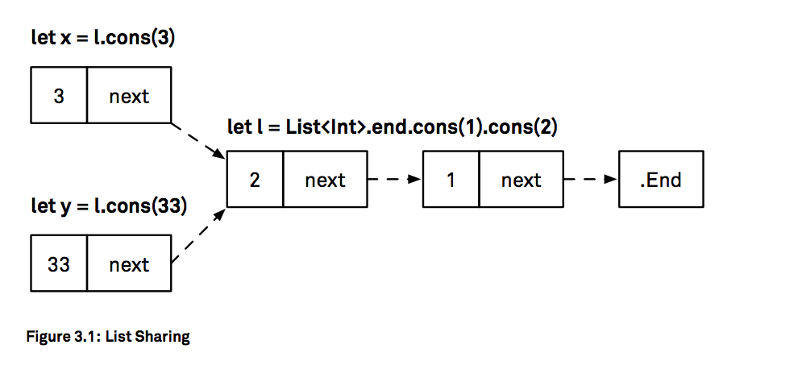

# Indices

- index : collection내의 위치를 나타냄

- 모든 collection은 **startIndex**와 **endIndex**를 가짐

  - startIndex : collection의 첫 element를 가리킴
  - endIndex : collection의 **마지막 element의 뒤에 오는** index
    - 따라서 endIndex는 **subscripting에 사용하기 적합하지 않음**
    - 인덱스 범위 (someIndex .. <endIndex)를 구성하거나 다른 인덱스를 비교할 수 있다 (예 : 루프의 중단 조건 (someIndex <endIndex 인 동안).

- collection의 index에 대한 유일한 요구 사항은 

  - ***index가 정의 된 순서를 갖는다는 것*** 
  - ***Comparable이어야한다***
  - Dictionary의 경우, key는 index가 아니다(주어진 키 다음에 어떤 index가 오는지 말해줄 수 없으므로)

- 과적으로, DictionaryIndex는 dictionary의 내부 저장소버퍼에서의 위치를 가리키는 불투명 한 값입니다.  이것은 실제로 하나의 Int 오프셋에 대한 wrapper 일 뿐이지 만 컬렉션 사용자에게는 아무런 관심이없는 구현 세부 사항입니다.(실제로 Objective-C API에서 전달되거나 반환 된 사전은 효율적인 브리징을 위해 NSDictionary를 지원 저장소에 사용하고 해당 사전의 인덱스 유형이 다르다. )

  - **index로 Dictionary를 subscripting**하면 ***optional value를 return하지 않지만***

  - **key를 이용해 subscripting** 하면 ***optional value를 return*** 한다.

    ```swift
    struct Dictionary {
      subscript(key: Key) -> Value?
    }

    protocol Collection {
      subscript(position: Index) -> Element { get }
    }
    ```

    - dictionary의 element 타입은 tuple type.

       ​


  ## Index Invavlidation

  - collection이 변경되면 index가 invalid될 수 있다.

    - index는 유효하지만 다른 element를 처리하는 경우(element를 앞에 추가하는 경우)
    - index가 유효하지 않은 경우(첫 번째 element를 제거하면 마지막 index였던 index가 invalid된다.)
    - Dictionary는 key-value쌍이 추가되어도 index는 stable하다.
      - dictionary가 너무 커져서 reallocation을 유발하기 전까진
        (이는 버퍼의 크기를 조정해야만 요소가 삽입되어 모든 요소를 다시 해시해야하므로 사전의 저장소 버퍼에있는 요소의 위치가 변경되지 않기 때문.)

  - 인덱스는 요소의 위치를 설명하는 데 필요한 최소한의 정보 만 저장하는 dump value이어야합니다. 특히, 가능하다면 indices는 그들의 collection에 대한 참조를 유지하지 않아야한다. 마찬가지로 collection은 일반적으로 "자체"indices 중 하나를 동일한 유형의 다른 collection에서 가져온 indices와 구별 할 수 없습니다. 다시 말하지만, 이것은 배열에 대해 명백하게 드러납니다. 물론 한 배열에서 파생 된 정수 인덱스를 사용하여 다른 인덱스를 인덱싱 할 수 있습니다

    ```swift
    let numbers = [1,2,3,4]
    let squares = numbers.map { $0 * $0 }
    let numbersIndex = numbers.index(of: 4)! // 3
    squares[numbersIndex] //16
    ```

    ​

    ​	
    ​

  ## Advancing Indices

- Swift 3은 컬렉션을 위해 인덱스 통과가 처리되는 방식을 크게 변경했습니다. 인덱스를 전방 또는 후방으로 전진시키는 (즉, 주어진 인덱스로부터 새로운 인덱스를 유도하는) 작업은 이제 콜렉션의 책임이며, 스위프트 2까지 인덱스는 스스로 전진 할 수 있습니다. 다음 색인으로 이동하기 위해 someIndex.successor ()를 작성한 곳에서 대신 collection.index (after : someIndex)를 작성할 수 있습니다.

- 이러한 변경은 ***성능***때문입니다. 다른 index로부터 index를 도출하는 것은, 종종 collection의 내부에 대한 정보를 필요로한다는 것을 알게되었습니다. index를 전진시키는 것이 간단한 추가 연산인 배열의 경우는 아닙니다. 예를 들어 문자열 색인은 실제 문자 데이터를 검사해야합니다. 문자는 Swift에서 크기가 다양하기 때문입니다.

- In the old model of self-advancing indices, this meant that the index had to store a
  reference to the collection’s storage. That extra reference was enough to defeat the
  copy-on-write optimizations used by the standard library collections and would result in
  unnecessary copies when a collection was mutated during iteration.(자기 전진 색인의 구식 모델에서 이는 색인이 모음의 저장소에 대한 참조를 저장해야한다는 것을 의미했습니다. 이 여분의 참조는 표준 라이브러리 컬렉션에서 사용되는 copy-on-write 최적화를 무력화시키기에 충분했으며 반복 중에 컬렉션이 변경되면 불필요한 복사본이 생성됩니다.)

- 사용자 정의 인덱스 유형을 더 간단하게 구현할 수 있습니다. 자신 만의 인덱스 유형을 구현할 때는 가능한 경우 인덱스가 컬렉션에 대한 참조를 유지하지 않아야 함을 명심하십시오.

  ​

  ​

  ## Linked List

- 정수 index가 없는 대표적인 collection 구현

  ```swift
  enum List<Element> {
    case end
    indirect case node(Element, nex: List<Element>)
  }
  ```

  - ***indirect*** : 컴파일러가 참조값으로 나타내야 한다는 것을 의미.
    (***enum은 value type*** - 이는 값의 변수가 위치에 대한 참조를 보유하는 것이 아니라 직접 값을 보유한다는 것을 의미. But ***indirect*** 사용하면 ***enum case를 참조로 유지***하여 ***자체에 대한 참조를 보유*** 할 수 있습니다.)

  - We prepend another element to the list by creating a new node, with the next: value set
    to the current node. 

    ```swift
    extension List {
    /// Return a new list by prepending a node with value `x` to the 
    /// front of a list.
    	func cons(_ x: Element) -> List {
    		return .node(x, next: self) }
    	}
    }

    // A 3-element list, of (3 2 1)
    let list = List<Int>.end.cons(1).cons(2).cons(3)
    // node(3, List<Swift.Int>.node(2, List<Swift.Int>.node(1, List<Swift.Int>.end)))
    ```

    ```swift
    extension List: ExpressibleByArrayLiteral { 
    	init(arrayLiteral elements: Element...) {
    		self = elements.reversed()
    					.reduce(.end) { partialList, element in 
                        partialList.cons(element)
    					} 
    	}
    }
    let list2: List = [3,2,1]
    // node(3, List<Swift.Int>.node(2, List<Swift.Int>.node(1, List<Swift.Int>.end)))
    ```

    - 구현은 먼저 입력 배열을 뒤집습니다 (목록이 끝에서 작성되기 때문에). reduce를 사용하여 요소를 .end 노드로 시작하여 하나씩 목록 앞에 추가합니다.
    - 이 목록 유형은 흥미로운 것이 있습니다 : "영구적"입니다. 노드는 변경 불가능합니다. 일단 생성되면 노드를 변경할 수 없습니다. 다른 element를 consing(목록의 앞에 요소를 추가하는 것)하는 것은 list를 복사하지 않습니다???????. 기존 목록의 맨 앞에 링크 된 새로운 노드를 제공합니다.
      
    - list의 불변성은 여기에서 중요합니다. list를 변경하거나 (예 : 마지막 항목을 제거하거나 노드에있는 요소를 업데이트하는 경우), 이 공유가 문제가 될 수 있습니다. x가 list를 변경하고 변경 사항이 y에 영향을 줄 수 있습니다.

  ​

  ​

  ## Stacks

  - 위의 list 도 stack. array도 stack

    ```swift
    /// A LIFO stack type with constant-time push and pop operations
    protocol Stack {
    /// The type of element held stored in the stack associatedtype Element
    /// Pushes `x` onto the top of `self` /// - Complexity: Amortized O(1). mutating func push(_: Element)
    /// Removes the topmost element of `self` and returns it, /// or `nil` if `self` is empty.
    /// - Complexity: O(1)
    	mutating func pop() -> Element?
    }
    ```

    - Array can be made to conform to Stack, like this:

      ```swift
      extension Array: Stack {
      	mutating func push(_ x: Element) { append(x) } 
      	mutating func pop() -> Element? { return popLast() }
      }
      ```

      ```swift
      extension List: Stack {
      	mutating func push(_ x: Element) {
      		self = self.cons(x) 
      	}
      	mutating func pop() -> Element? { 
      		switch self {
      		case .end: 	
      			return nil
      		case let .node(x, next: xs): 
      			self = xs	 
      			return x 
      		}
      	} 
      }
      ```

      - 위의 mutating method는 list를 change 하는게 아니라, 변수가 참조하는 list의 일부를 chnage 합니다

        ```swift
        var stack: List<Int> = [3,2,1] 
        var a = stack
        var b = stack

        a.pop() // Optional(3) 
        a.pop() // Optional(2) 
        a.pop() // Optional(1)

        stack.pop() // Optional(3) 
        stack.push(4)

        b.pop() // Optional(3) 
        b.pop() // Optional(2) 
        b.pop() // Optional(1)

        stack.pop() // Optional(4) 
        stack.pop() // Optional(2) 
        stack.pop() // Optional(1)
        ```

        

        

        ​

        ​			
        ​		
        ​	

    ## Conforming List to Sequence

    - 목록 변수는 목록의 반복자이므로 List to Sequence를 준수하는 데 사용할 수 있습니다. 사실, List는 시퀀스와 반복자 사이의 관계에 대해 이야기했을 때와 같이 자체 반복 상태를 갖는 불안정한 시퀀스의 예입니다. next () 메서드를 제공하면 IteratorProtocol 및 Sequence에 대한 적합성을 한 번에 추가 할 수 있습니다. 이것의 구현은 pop의 경우와 완전히 같습니다.(Since list variables are iterators into the list, this means you can use them to conform List to Sequence. As a matter of fact, List is an example of an unstable sequence that
      carries its own iteration state, like we saw when we talked about the relationship
      between sequences and iterators. We can add conformance to IteratorProtocol and
      Sequence in one go just by providing a next() method; the implementation of this is
      exactly the same as for pop:)

      ```swift
      extension List: IteratorProtocol, Sequence { 
      	mutating func next() -> Element? {
      		return pop() 
      	}

      let list: List = ["1", "2", "3"] 
      for x in list {
      print("\(x) ", terminator: "") } 
      // 1 2 3
      }
      ```

      - 이것은 또한 프로토콜 확장 기능을 통해 수십 개의 표준 라이브러리 함수가있는 List를 사용할 수 있음을 의미합니다.

        ```swift
        list.joined(separator: ",") // 1,2,3 
        list.contains("2") // true
        list. atMap { Int($0) } // [1, 2, 3] 
        list.elementsEqual(["1", "2", "3"]) // true
        ```

    ​

    ​

    ​

    ## Conforming List to Collection

    - 다음으로, 우리는 List가 Collection을 따르도록 만듭니다. 그렇게하기 위해서는 list에 대한 index 유형을 결정해야합니다. 위에서 말한 바에 따르면 최상의 인덱스는 컬렉션의 저장소에있는 간단한 정수 오프셋 인 경우가 많지만 linked List에 인접한 저장소가 없기 때문에이 경우에는 작동하지 않습니다. 정수 인덱스 (예를 들어,리스트의 선두로부터 노드까지의 스텝 수)는 startIndex로부터 매번리스트를 횡단해야 할 것이므로, 첨자 액세스는 O (n) 연산이된다. 그러나 Collection에 대한 설명서에서는 **"많은 collection operation이 자체 성능 보증을 위해 O (1) subscripting performance에 의존하기 때문에 O (1)"**이 필요합니다.

    - 따라서 index은 목록 노드를 직접 참조해야합니다. List는 불변이므로 Copy-On-Write 최적화를 사용하지 않기 때문에 성능에 문제가되지 않습니다.

    - 이미 List를 iterator로 직접 사용 했으므로 여기서도 동일한 작업을 수행하고 enum 자체를 인덱스로 사용하려고합니다. 그러나 이것은 문제로 이어질 것입니다. 예를 들어, 인덱스와 컬렉션은 ==의 매우 다른 구현을 필요로합니다.

    - index는 같은 list로부터의 두 indice가 같은 position에 있는지를 알 필요가 있다. Equatable에 부합하는 요소는 필요 없다.
    - 반면에 collection은 두 개의 다른 list를 비교하여 동일한 요소를 보유하고 있는지 확인할 수 있어야합니다. Equatable에 부합하는 요소가 필요합니다.

    - 별도의 유형을 만들어 인덱스와 컬렉션을 나타내면 두 개의 서로 다른 == 연산자에 대해 서로 다른 동작을 구현할 수 있습니다. 그리고 노드 열거 형을 가지지 않아도 노드 구현을 비공개로 만들 수 있으며 컬렉션의 사용자로부터 세부 정보를 숨길 수 있습니다. 새 ListNode 유형은 List의 첫 번째 변형과 같습니다.

      ```swift
      /// Private implementation detail of the List collection
      fileprivate enum ListNode<Element> {
      	case end
      	indirect case node(Element, next: ListNode<Element>)

      	func cons(_ x: Element) -> ListNode<Element> { 
      		return .node(x, next: self)
      	}
      }
      ```

    - 인덱스 유형은 ListNode를 wrapping합니다. 콜렉션 인덱스가되기 위해서는 유형이 두 가지 요구 사항 만있는 Comparable을 준수해야합니다. 즉,보다 작음 연산자 (<)가 필요하며 등호 연산자 (==)가 필요합니다.이 연산자는 프로토콜에서 상속됩니다 Equatable에서. >, <= 및> =과 같은 다른 연산자에는 처음 두 가지와 같은 기본 구현이 있습니다.

    - ==와 <를 구현할 수있는 몇 가지 추가 정보가 필요합니다. 앞에서 설명한 것처럼 노드는 값이고 값은 ID를 갖지 않습니다. 그렇다면 두 변수가 같은 노드를 가리키는 지 어떻게 알 수 있습니까? 이를 위해 각 색인에 증가 숫자 (.end 노드의 태그가 0 인 태그)를 붙입니다. 앞으로 살펴 보 겠지만 노드에 태그를 저장하면 매우 효율적인 작업이 가능합니다. 목록이 작동하는 방식으로 동일한 태그가있는 경우 동일한 목록에있는 두 개의 색인이 동일해야합니다.

      ```swift
      public struct ListIndex<Element>: CustomStringConvertible {  
      	fileprivate let node: ListNode<Element>
      	fileprivate let tag: Int
      	
      	public var description: String { 
      		return "ListIndex(\(tag))"
      	}
      }
      ```

    - 또 다른 주목할 점은 ListIndex는 public struct이지만 fileprivate (노드 및 태그)가 있다는 것입니다. 이는 공개적으로 구성 할 수 없다는 것을 의미합니다. ListIndex (node : tag :)의 기본 memberwise 초기화 프로그램은 사용자가 액세스 할 수 없습니다. List로부터 ListIndex를 넘길 수는 있지만 직접 만들 수는 없습니다. 이는 구현 세부 사항을 숨기고 안전을 제공하는 데 유용한 기술입니다.

      ​

      ```swift
      extension ListIndex: Comparable {
      	public static func == <T>(lhs: ListIndex<T>, rhs: ListIndex<T>) -> Bool {
      		return lhs.tag == rhs.tag 
      	}
      	public static func < <T>(lhs: ListIndex<T>, rhs: ListIndex<T>) -> Bool { // startIndex has the highest tag, endIndex the lowest
      	return lhs.tag > rhs.tag
      	} 
      }
      ```

    - 적절한 인덱스 타입을 얻었으므로, 다음 단계는 Collection을 따르는 List 구조체를 만드는 것입니다.

      ```swift
      public struct List<Element>: Collection {
      // Index's type could be inferred, but it helps make the rest of // the code clearer:
      	public typealias Index = ListIndex<Element>
      	public let startIndex: Index public let endIndex: Index
      	public subscript(position: Index) -> Element { 
      		switch position.node {
      		case .end: 
      			fatalError("Subscript out of range") 
      		case let .node(x, _): 
      			return x
      	} 
      }
      public func index(after idx: Index) -> Index { 
      	switch idx.node {
      	case .end: 
      		fatalError("Subscript out of range")
      	case let .node(_, next): 
      		return Index(node: next, tag: idx.tag - 1) }
      	}
      }
      ```

      ​

    ​


  ​			
  ​		
  ​	


  ​			
  		
  ​	


​	